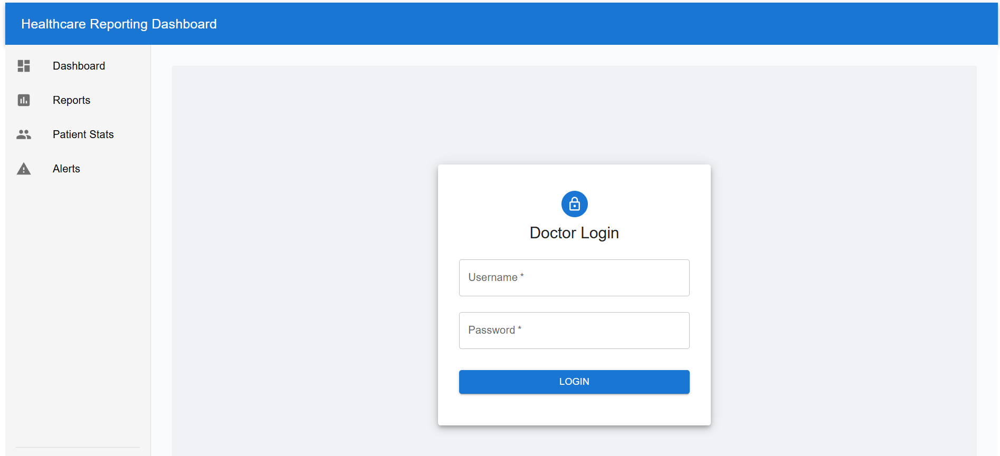
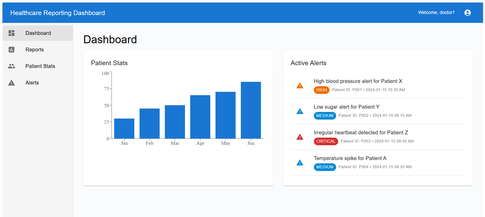
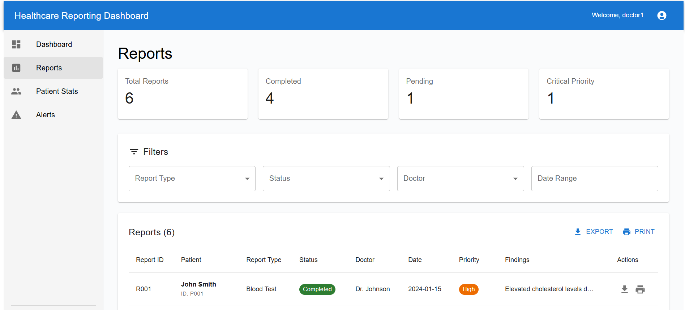
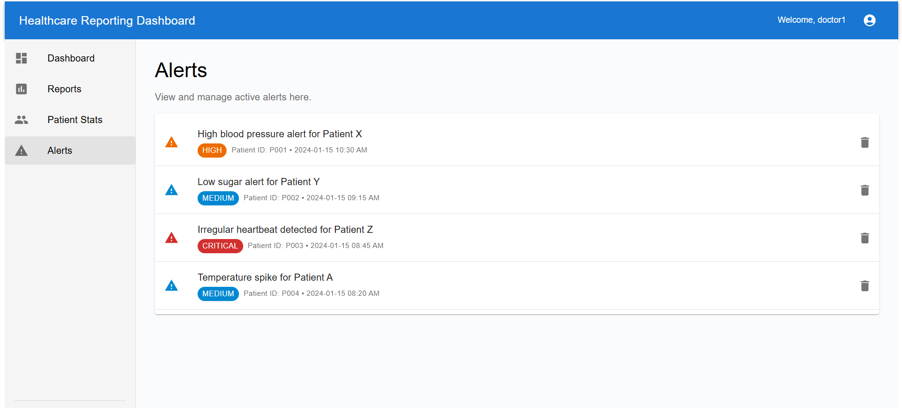

# Healthcare Reporting Dashboard

A comprehensive healthcare management system built with React frontend and Spring Boot, MySQL backend, featuring patient statistics, medical reports, alerts management, and real-time dashboard analytics.

### Frontend (React)
### Backend (Spring Boot, MySQL)

## 🛠️ Prerequisites

Before running this application, ensure you have the following installed:

### Required Software
- **Java 17** (or higher)
- **Node.js 16** (or higher)
- **MySQL 8.0** (or higher)
- **Maven 3.6** (or higher)

## 📋 Setup Instructions

### Step 1: Database Setup

1. **Start MySQL & Create Database**
   ```sql
   Create Database healthcare;
   ```

2. **Add Data**
   ```sql
  USE healthcare;
    -- The 'doctor' table is automatically created when the backend starts.
    -- So, make sure to run the backend first before executing the INSERT command.
   INSERT INTO doctor (username, password, role) VALUES ('doctor1', 'password123', 'DOCTOR'); 
   ```

### Step 2: Backend Setup

1. **Navigate to Backend Directory**
   ```bash
   cd backend
   ```

2. **Configure Database Connection**
   - Edit `src/main/resources/application.properties`
   - Update database credentials:
   ```properties
   spring.datasource.username=your_username
   spring.datasource.password=your_password
   ```

3. **Build and Run Backend**
   ```bash
   # Clean and compile
   mvn clean compile
   
   # Run the application
   mvn spring-boot:run
   ```

4. **Verify Backend is Running**
   - Open browser and go to: `http://localhost:8081/auth/test`
   - You should see: "Backend is working!"

### Step 3: Frontend Setup

1. **Navigate to Frontend Directory**
   ```bash
   cd frontend
   ```

2. **Install Dependencies**
   ```bash
   npm install
   ```

3. **Start Development Server**
   ```bash
   npm start
   ```

4. **Verify Frontend is Running**
   - Open browser and go to: `http://localhost:3000`
   - You should see the login page

### Step 4: Login and Test

1. **Default Login Credentials**
   - Username: `doctor`
   - Password: `password`

2. **Test All Features**
   - Login to the system
   - Navigate through all pages
   - Test logout functionality

## 🚀 Running the Application

### Development Mode

1. **Start Backend** (Terminal 1)
   ```bash
   cd backend
   mvn spring-boot:run
   ```

2. **Start Frontend** (Terminal 2)
   ```bash
   cd frontend
   npm start
   ```

3. **Access Application**
   - Frontend: `http://localhost:3000`
   - Backend API: `http://localhost:8081`

Note: Make sure the frontend is running on port 3000 and the backend is running on port 8081. If your system uses different ports, please update them accordingly.

**Glimpse of Project**

## 📸 Screenshots

### Login Page


### Dashboard


### Patient Stats


### Reports


### Alerts


**Happy Coding! 🎉** 